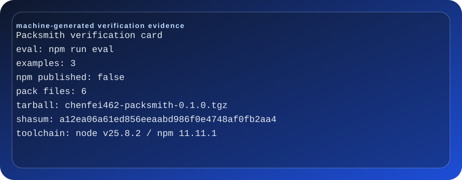
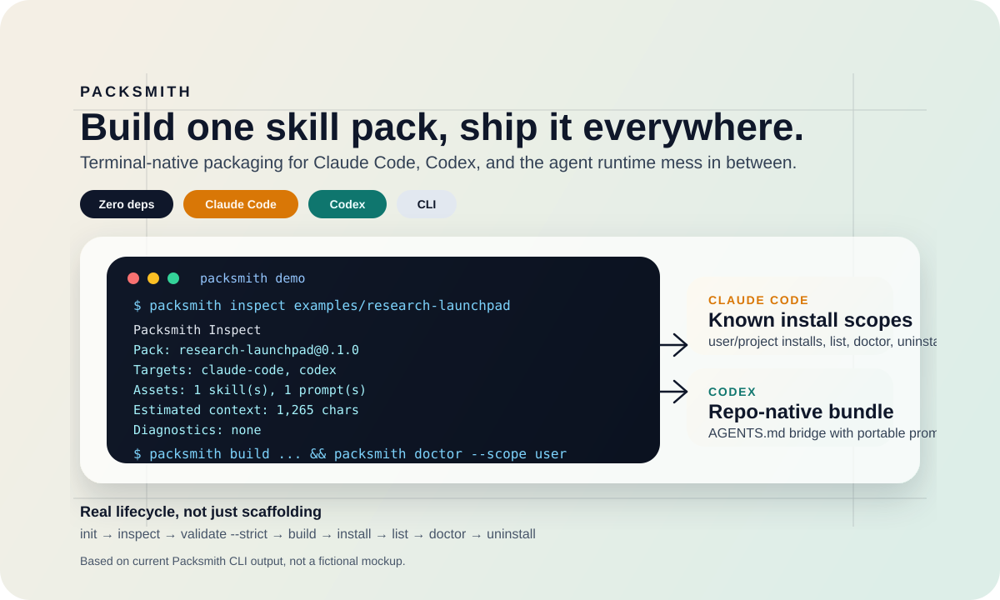
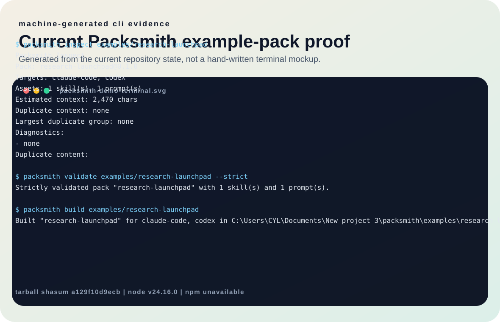

# Packsmith

Build one skill pack, ship it to every coding agent runtime.

[](https://github.com/chenfei462/packsmith/actions/workflows/ci.yml)
[](https://github.com/chenfei462/packsmith/actions/workflows/publish.yml)
`Node >=20` `Zero runtime deps` `Targets: claude-code + codex`
[Verification Snapshot](./docs/verification.md)

Current verification: `npm run eval` | example packs: 3 | npm published: false | npm pack files: 6
当前验证：`npm run eval` | 示例 packs：3 | npm 已发布：false | npm pack 文件数：6

[中文](#中文) | [English](#english)





## English

### What it is

`packsmith` is a zero-dependency CLI for packaging reusable agent skills and prompts. You author one source pack, validate it, inspect its context footprint, build target-specific bundles, and install those bundles locally.

The hero graphic above is based on current Packsmith CLI flows, not a fictional mockup.

Current targets:

- `claude-code`
- `codex`

### Target support matrix

| Runtime | Build bundles | Direct install | Installed bundle introspection |
| --- | --- | --- | --- |
| `claude-code` | yes | `install --scope user|project` | `list / doctor / uninstall` |
| `codex` | yes | explicit `install --dest` | no built-in `list / doctor / uninstall` flow yet |

### Why this project exists

The agent-skills ecosystem already has demand. What it lacks is packaging discipline.

As of May 13, 2026:

- GitHub `agent-skills` listed 4,526 public repositories.
- `anthropics/skills` showed 133k stars.
- real issues in that ecosystem were still about discoverability, duplicate loading, and install-path mismatches.

See [GitHub demand research](./docs/github-demand-2026-05.md) for source links and issue context.

That is the wedge for Packsmith: not another giant skills repo, but the distribution layer between authors and runtimes.

### The product loop

```bash
packsmith init my-pack
packsmith inspect my-pack
packsmith validate my-pack
packsmith install my-pack --target claude-code --scope user
packsmith list --target claude-code --scope user
packsmith doctor --target claude-code --scope user
packsmith uninstall my-pack --target claude-code --scope user
```

That flow gives you a complete loop:

1. scaffold a reusable pack
2. inspect context size before shipping
3. validate file layout, manifest integrity, and fail CI with `--strict` when diagnostics appear
4. install directly from a source pack or from a prebuilt bundle
5. build runtime-specific bundles when you want distributable artifacts
6. inspect installed Claude Code bundles from saved metadata
7. diagnose install targets, installed state, and broken installs for a scope
8. remove installed Claude Code bundles cleanly using saved metadata

### First run

Packsmith currently requires Node.js `>=20`.

As of May 13, 2026, the scoped npm package `@chenfei462/packsmith` is not published yet. The fastest verifiable way to evaluate the project today is one command from the repo root:

```bash
npm install
npm run eval
```

`npm run eval` runs the current recommended evaluation flow and prints a fixed summary at the end.

That flow verifies four concrete things in temporary space:

1. `init`, `inspect`, `validate`, and `build` work from source
2. a Codex install with `--dest` emits a real `AGENTS.md` bridge file
3. a Claude Code scoped install can be listed, diagnosed, and uninstalled cleanly
4. the packed npm tarball installs a working `packsmith` CLI entrypoint

It does not leave `.claude/`, `temp-smoke-pack/`, or other demo debris in your checkout.

Under the hood it runs `smoke:example`, `examples:check`, and `release:check`, so example quality and release posture do not drift silently over time.

If you want to inspect the bundled example manually after that:

```bash
node src/cli.mjs inspect examples/research-launchpad
node src/cli.mjs validate examples/research-launchpad --strict
node src/cli.mjs build examples/research-launchpad
node src/cli.mjs inspect examples/incident-triage
```

### Example packs

Packsmith now ships three intentionally different example packs so the repo proves more than one narrow workflow:

- [`examples/research-launchpad`](./examples/research-launchpad): discovery and product-positioning work driven by GitHub demand signals
- [`examples/incident-triage`](./examples/incident-triage): operational debugging and stakeholder-update workflows for production incidents
- [`examples/maintainer-handoff`](./examples/maintainer-handoff): onboarding, runbook capture, and ownership-transfer workflows for an incoming maintainer

That spread matters. It shows Packsmith is useful for exploratory research, high-pressure operations, and internal knowledge transfer, not just one marketing-shaped demo pack.

### Why not copy folders by hand

Copying skill folders manually is fine for one-off experiments. It breaks down once you want repeatable installs and a repo you can trust.

- manual copying does not track installs, so you cannot reliably list what came from which pack later
- manual copying does not detect drift, so missing skills or mirrored prompts only show up after a runtime breaks
- manual copying gives you no strict validation, so prompt collisions and malformed `SKILL.md` files slip through until much later

Packsmith exists to make those failure modes explicit before they become operational noise.

### Install

The unscoped npm package name `packsmith` is already taken by another project.

The scoped package name for this project is reserved in `package.json`, but it is not published on npm yet as of May 13, 2026.

Today there are two honest install paths:

1. Evaluate from source:

```bash
npm test
npm run eval
```

2. Verify the publishable tarball locally before any npm release:

```bash
npm pack --dry-run
npm run eval
```

Once the scoped package is published, the intended global install path is:

```bash
npm install -g @chenfei462/packsmith
packsmith --help
```

For Claude Code, Packsmith can install into known directories instead of a manual destination:

```bash
packsmith install examples/research-launchpad --target claude-code --scope user
packsmith install examples/research-launchpad --target claude-code --scope project
packsmith list --target claude-code --scope user
packsmith doctor --target claude-code --scope user
packsmith uninstall research-launchpad --target claude-code --scope user
```

- `install` accepts either a source pack directory with `packsmith.json` or a prebuilt bundle directory with `manifest.json`
- `--scope user` installs skills into `~/.claude/skills/`
- `--scope project` installs skills into `<repo>/.claude/skills/`
- Pack metadata and prompts are mirrored under `.claude/packsmith/<pack-name>/`
- `list` reads that mirrored metadata to show what is installed in each scope, including concrete skill and prompt ids
- `doctor` shows the resolved install roots plus installed bundle metadata for a scope, including concrete skill and prompt ids, and whether any installed skill or mirrored prompt files are missing
- `uninstall` uses that mirrored metadata to remove installed skills cleanly
- scoped installs reject skill-name collisions when another pack already owns that Claude Code skill directory
- `validate` rejects prompt basename collisions that would silently overwrite bundle output during `build`

For Codex, keep using explicit `--dest` because the runtime story is still repo-oriented around `AGENTS.md`.

### Release posture

Packsmith now treats release readiness as a first-class check:

```bash
npm run release:check
```

That gate verifies:

- scoped npm package metadata
- public publish config
- repo/homepage/issues links
- bilingual README anchors and sections
- publish-file allowlist
- presence of `README.md`, `LICENSE`, and `.npmignore`
- a GitHub Actions publish workflow using npm trusted publishing and provenance

The repo also ships a dedicated publish workflow for GitHub Releases, so the documented local gate and CI gate stay aligned.

The current machine-generated verification snapshot lives in [`docs/verification.md`](./docs/verification.md).

### Publish footprint

The current `npm pack --dry-run` output is intentionally small. The exact footprint is verified by `npm run release:check` against the real dry-run result, not by README-only copy.

- published files: `LICENSE`, `README.md`, `package.json`, `src/cli.mjs`, `src/lib/fs-utils.mjs`, `src/lib/pack.mjs`
- excluded on purpose: docs, examples, tests, and release-only repo files

### Current limits

- today the maintained runtime targets are still only `claude-code` and `codex`
- Codex installs still rely on an explicit `--dest` flow rather than a known-directory adapter
- there is no remote pack registry or remote pack fetch flow yet; the project is still local-first

### Why it is different

- Author once, validate once, build for every agent.
- Human-readable `inspect` output for fast triage.
- Machine-readable `inspect --json` output for automation.
- Duplicate-content diagnostics to catch wasted context before install.
- Oversized-pack warnings to keep bundles practical.
- Claude Code install adapters for known user-level and project-level skill directories.
- Claude Code uninstall flow backed by installed metadata.
- Claude Code list flow for inspecting installed packs by scope with real skill/prompt ids.
- Claude Code doctor flow for troubleshooting install paths, installed state, and broken installs with real skill/prompt ids.
- Collision protection so one Claude Code pack cannot silently overwrite another pack's skill directory.
- Prompt basename collision protection so one prompt file cannot silently overwrite another during build.
- Release checks that verify publish metadata and trusted publishing workflow setup.
- Zero runtime dependencies and a small readable codebase.

### Example inspect output

```text
Packsmith Inspect
Pack: research-launchpad@0.1.0
Targets: claude-code, codex
Assets: 1 skill(s), 1 prompt(s)
Estimated context: 1,265 chars

Diagnostics:
- none

Duplicate content:
- none
```

### Pack format

Every pack starts from a `packsmith.json` manifest:

```json
{
  "name": "research-launchpad",
  "description": "GitHub demand research pack for coding agents.",
  "version": "0.1.0",
  "targets": ["claude-code", "codex"],
  "skills": [
    {
      "id": "github-demand",
      "path": "skills/github-demand",
      "description": "Research GitHub demand signals and convert them into a launch thesis."
    }
  ],
  "prompts": [
    {
      "id": "launch",
      "path": "prompts/launch.md",
      "description": "Turn raw GitHub signals into a concrete MVP."
    }
  ]
}
```

### Commands

- `packsmith init <pack-dir>`: scaffold a new pack
- `packsmith validate <pack-dir>`: verify manifest, skills, prompts, and targets
- `packsmith validate <pack-dir>` also enforces `SKILL.md` YAML frontmatter with valid `name` and `description`
- `packsmith validate <pack-dir> --strict`: fail on duplicate-content or oversized-pack diagnostics
- `packsmith inspect <pack-dir> [--json]`: summarize assets, context weight, and diagnostics
- `packsmith list --target claude-code --scope <project|user> [--json]`: show installed Claude Code packs for a scope
- `packsmith doctor --target claude-code --scope <project|user> [--json]`: show resolved Claude Code install paths, installed bundles, and integrity status
- `packsmith build <pack-dir> [--out dist]`: emit target bundles under `dist/<pack-name>/`
- `packsmith install <pack-or-built-dir> --target <name> --dest <dir>`: copy one built bundle into a destination, or auto-build from a source pack first
- `packsmith install <pack-or-built-dir> --target claude-code --scope <project|user>`: install directly into known Claude Code skill directories from a source pack or prebuilt bundle
- `packsmith uninstall <pack-name> --target claude-code --scope <project|user>`: remove an installed Claude Code pack using saved metadata

### Repository story

This repo is intentionally small and launchable:

- three real example packs:
  [`examples/research-launchpad`](./examples/research-launchpad) for discovery/positioning work,
  [`examples/incident-triage`](./examples/incident-triage) for operational incident workflows,
  and [`examples/maintainer-handoff`](./examples/maintainer-handoff) for onboarding and ownership-transfer work
- one CLI entrypoint in [`src/cli.mjs`](./src/cli.mjs)
- one core implementation module in [`src/lib/pack.mjs`](./src/lib/pack.mjs)
- tests covering `init`, `validate`, `inspect`, `build`, and `install`
- CI on pushes and pull requests

### Maintainer docs

- [Positioning](./docs/positioning.md)
- [Launch plan](./docs/launch-plan.md)
- [GitHub demand research](./docs/github-demand-2026-05.md)
- [Runtime assumptions](./docs/runtime-assumptions.md)
- [Specification](./docs/specification.md)

### Roadmap

- add runtime-specific lint rules
- add known-directory install adapters
- add lockfiles and remote pack sources
- add signed bundles and registry metadata

### License

MIT

## 中文

### 这是什么

`packsmith` 是一个零运行时依赖的 CLI，用来把可复用的 Agent skill 和 prompt 打包成面向不同运行时的分发产物。你只需要维护一份源 pack，然后执行检查、体积诊断、构建和本地安装。

上面的首屏图基于当前真实 CLI 流程，而不是虚构的 marketing mockup。

下面的终端演示图也基于当前真实 CLI 输出，用来展示 `inspect`、直接安装和 `doctor` 的组合效果。

当前支持的目标运行时：

- `claude-code`
- `codex`

### 目标支持矩阵

| Runtime | 构建 bundle | 直接安装 | 已安装 bundle 诊断 |
| --- | --- | --- | --- |
| `claude-code` | 支持 | `install --scope user|project` | `list / doctor / uninstall` |
| `codex` | 支持 | 显式 `install --dest` | 还没有内建的 `list / doctor / uninstall` 流程 |

### 为什么要做这个项目

Agent skills 这个赛道已经被验证有需求，但“如何分发、如何验证、如何避免上下文浪费”还没有被认真解决。

截至 2026 年 5 月 13 日：

- GitHub 的 `agent-skills` topic 下有 4,526 个公开仓库。
- `anthropics/skills` 有 133k stars。
- 社区里的真实问题仍集中在技能发现困难、重复加载浪费上下文、安装路径不一致。

更多来源和 issue 上下文见 [GitHub 需求研究](./docs/github-demand-2026-05.md)。

所以 Packsmith 的定位不是再做一个大而全的技能库，而是做作者和运行时之间的“打包层”。

### 核心流程

```bash
packsmith init my-pack
packsmith inspect my-pack
packsmith validate my-pack
packsmith install my-pack --target claude-code --scope user
packsmith list --target claude-code --scope user
packsmith doctor --target claude-code --scope user
packsmith uninstall my-pack --target claude-code --scope user
```

这八步组成一个完整闭环：

1. 初始化一个可复用的 pack
2. 在发布前检查上下文体积
3. 验证清单与文件结构，并可通过 `--strict` 把诊断项直接变成 CI 失败
4. 直接从源 pack 或预构建 bundle 执行安装
5. 在需要分发产物时再构建面向不同运行时的 bundle
6. 基于安装时保存的元数据，查看 Claude Code 当前已安装的 pack
7. 诊断某个 scope 的实际安装路径、已安装状态和损坏安装
8. 基于安装时保存的元数据，干净卸载 Claude Code 中的已安装 pack

### 快速上手

Packsmith 当前要求 Node.js `>=20`。

截至 2026 年 5 月 13 日，scoped npm 包 `@chenfei462/packsmith` 还没有正式发布。当前最可验证、也最诚实的体验路径仍然是直接从仓库运行：

```bash
npm install
npm run eval
```

`npm run eval` 会执行当前推荐的评估流程，并在最后打印一段固定摘要。

这条路径现在会在临时空间里验证四件具体的事：

1. `init`、`inspect`、`validate`、`build` 这条源码路径可用
2. `install --target codex --dest ...` 会生成真实的 `AGENTS.md` 桥接文件
3. Claude Code 的 scoped install 可以完成 `list / doctor / uninstall` 闭环
4. 打包后的 npm tarball 能安装出一个可执行的 `packsmith` CLI 入口

整个流程不会把 `.claude/`、`temp-smoke-pack/` 或其他演示残留写回当前仓库。

在内部，它会串起 `smoke:example`、`examples:check` 和 `release:check`，避免示例质量和发布姿态随时间悄悄漂移。

如果你想继续手动检查自带示例 pack，再执行：

```bash
node src/cli.mjs inspect examples/research-launchpad
node src/cli.mjs validate examples/research-launchpad --strict
node src/cli.mjs build examples/research-launchpad
node src/cli.mjs inspect examples/incident-triage
```

### 示例 packs

Packsmith 现在自带三个刻意风格不同的示例 pack，用来证明这个项目并不只适合单一场景：

- [`examples/research-launchpad`](./examples/research-launchpad)：偏需求研究和产品定位，围绕 GitHub 需求信号展开
- [`examples/incident-triage`](./examples/incident-triage)：偏线上事故排查和状态同步，适合生产环境排障流程
- [`examples/maintainer-handoff`](./examples/maintainer-handoff)：偏维护者交接、runbook 补齐和新 owner 上手流程

这三类示例放在一起的意义是：Packsmith 既能承载探索型工作流，也能承载高压运维场景和内部知识交接场景，而不是只展示一个“看起来像 demo” 的 pack。

### 为什么不要手动复制文件夹

手动复制 skill 文件夹做一次性试验没问题，但一旦你希望安装过程可复现、仓库状态可信，这种做法很快就会失控。

- 手动复制不会留下安装记录，之后你很难可靠地知道某个 skill 到底来自哪个 pack
- 手动复制不会检测漂移，缺失的 skill 或镜像 prompt 往往要等到运行时出问题才会暴露
- 手动复制没有严格校验，prompt 命名冲突和不合规的 `SKILL.md` 往往会拖到更后面才爆炸

Packsmith 的价值，就是把这些失败模式前置成显式检查，而不是把它们留给后续运维噪音。

### 安装方式

npm 上无 scope 的 `packsmith` 名称已经被其他项目占用。

这个项目对应的 scoped 包名已经写进 `package.json`，但截至 2026 年 5 月 13 日还没有正式发布到 npm。

当前有两条诚实的使用路径：

1. 从源码直接评估：

```bash
npm test
npm run eval
```

2. 在本地验证未来发布包的可执行性：

```bash
npm pack --dry-run
npm run eval
```

等 scoped 包真正发布之后，预期的全局安装路径会是：

```bash
npm install -g @chenfei462/packsmith
packsmith --help
```

对 Claude Code，Packsmith 可以直接安装到已知目录，不用手动指定目标路径：

```bash
packsmith install examples/research-launchpad --target claude-code --scope user
packsmith install examples/research-launchpad --target claude-code --scope project
packsmith list --target claude-code --scope user
packsmith doctor --target claude-code --scope user
packsmith uninstall research-launchpad --target claude-code --scope user
```

- `install` 既可以接收带 `packsmith.json` 的源 pack 目录，也可以接收带 `manifest.json` 的预构建 bundle 目录
- `--scope user` 安装到 `~/.claude/skills/`
- `--scope project` 安装到 `<repo>/.claude/skills/`
- pack 的元数据和 prompts 会同步写到 `.claude/packsmith/<pack-name>/`
- `list` 会读取这些 metadata，展示某个 scope 下当前已安装的 pack，以及其中具体的 skill / prompt id
- `doctor` 会展示该 scope 解析出来的安装路径，以及当前可见的 pack metadata、skill / prompt id，以及是否存在缺失文件
- `uninstall` 会利用这些元数据精确移除已安装 skill
- 如果另一个 pack 已经占用了同名 skill 目录，scoped install 会直接拒绝覆盖
- 如果两个 prompt 最终会生成同名输出文件，`validate` 会直接拒绝，避免 `build` 时静默覆盖

对于 Codex，当前仍建议继续使用显式 `--dest`，因为它的运行时入口更偏向 repo 内的 `AGENTS.md` 桥接方式。

### 发布姿态

Packsmith 现在把发布准备状态也做成了显式检查：

```bash
npm run release:check
```

这个 gate 会校验：

- scoped npm 包元数据
- 公开发布配置
- repo / homepage / issues 链接
- 中英双语 README 的锚点和分节是否全部存在
- 发布文件白名单
- `README.md`、`LICENSE`、`.npmignore` 是否存在
- GitHub Actions 是否使用 npm trusted publishing 和 provenance

仓库里也提供了面向 GitHub Release 的 publish workflow，所以本地检查和 CI 检查是一套语义，而不是两套不同标准。

### 发布体积

当前 `npm pack --dry-run` 的发布体积被刻意控制得很小，但具体体积数字不再靠 README 手写维护，而是由 `npm run release:check` 直接校验真实 dry-run 结果。

- 实际发布文件：`LICENSE`、`README.md`、`package.json`、`src/cli.mjs`、`src/lib/fs-utils.mjs`、`src/lib/pack.mjs`
- 明确不进入发布包的内容：docs、examples、tests，以及只服务于仓库协作的发布辅助文件

### 当前边界

- 目前持续维护的 runtime 目标仍然只有 `claude-code` 和 `codex`
- 对 Codex 的安装仍然依赖显式 `--dest`，还没有做成已知目录适配器
- 现在还没有远程 pack registry 或远程 pack 拉取流程，这个项目依然是 local-first

### 这个项目为什么更像一个值得 star 的基础设施项目

- 一次编写，多端分发，而不是复制粘贴不同运行时目录。
- `inspect` 默认输出对人友好，便于快速判断。
- `inspect --json` 保留自动化集成能力。
- 能发现 skills 和 prompts 之间的重复内容，提前暴露上下文浪费。
- 能对超大 pack 给出预警，避免 bundle 失控。
- 对 Claude Code 提供 user/project 两级已知目录安装适配器。
- 对 Claude Code 提供基于 metadata 的卸载闭环。
- 对 Claude Code 提供带具体 skill / prompt 明细的已安装 pack 列表能力。
- 对 Claude Code 提供带具体 skill / prompt 明细和完整性状态的安装路径诊断能力。
- 对 Claude Code scoped install 提供同名 skill 冲突保护，避免 pack 之间静默互相覆盖。
- 对构建阶段提供 prompt 输出文件名冲突保护，避免 bundle 内静默覆盖。
- 对 npm 发布提供元数据和 trusted publishing 检查。
- 代码小、依赖少、容易通读。

### 示例清单

每个 pack 都从一个 `packsmith.json` 开始：

```json
{
  "name": "research-launchpad",
  "description": "GitHub demand research pack for coding agents.",
  "version": "0.1.0",
  "targets": ["claude-code", "codex"],
  "skills": [
    {
      "id": "github-demand",
      "path": "skills/github-demand",
      "description": "Research GitHub demand signals and convert them into a launch thesis."
    }
  ],
  "prompts": [
    {
      "id": "launch",
      "path": "prompts/launch.md",
      "description": "Turn raw GitHub signals into a concrete MVP."
    }
  ]
}
```

### 命令列表

- `packsmith init <pack-dir>`：初始化新 pack
- `packsmith validate <pack-dir>`：校验 manifest、skills、prompts 和 target
- `packsmith validate <pack-dir>` 还会校验 `SKILL.md` 的 YAML frontmatter，以及合法的 `name` / `description`
- `packsmith validate <pack-dir> --strict`：当发现重复内容或超大 pack 风险时直接失败
- `packsmith inspect <pack-dir> [--json]`：输出资产概览、上下文体积和诊断信息
- `packsmith list --target claude-code --scope <project|user> [--json]`：查看某个 Claude Code scope 下已安装的 pack
- `packsmith doctor --target claude-code --scope <project|user> [--json]`：查看解析后的安装路径、当前已安装状态和完整性信息
- `packsmith build <pack-dir> [--out dist]`：在 `dist/<pack-name>/` 下构建目标 bundle
- `packsmith install <pack-or-built-dir> --target <name> --dest <dir>`：把某个 bundle 复制到目标目录，或先从源 pack 自动构建再安装
- `packsmith install <pack-or-built-dir> --target claude-code --scope <project|user>`：从源 pack 或预构建 bundle 直接安装到 Claude Code 已知技能目录
- `packsmith uninstall <pack-name> --target claude-code --scope <project|user>`：基于保存的元数据卸载 Claude Code 中的已安装 pack

### 仓库内容

- 三个真实例子：
  [`examples/research-launchpad`](./examples/research-launchpad) 用于需求研究/定位，
  [`examples/incident-triage`](./examples/incident-triage) 用于值班/事故排查，
  [`examples/maintainer-handoff`](./examples/maintainer-handoff) 用于维护者 onboarding 和所有权交接
- 一个 CLI 入口：[`src/cli.mjs`](./src/cli.mjs)
- 一个核心实现模块：[`src/lib/pack.mjs`](./src/lib/pack.mjs)
- 覆盖 `init`、`validate`、`inspect`、`build`、`install` 的测试
- push 和 PR 上自动运行 CI

### 维护文档

- [产品定位](./docs/positioning.md)
- [发布计划](./docs/launch-plan.md)
- [GitHub 需求研究](./docs/github-demand-2026-05.md)
- [运行时假设](./docs/runtime-assumptions.md)
- [规格说明](./docs/specification.md)

### 许可证

MIT
